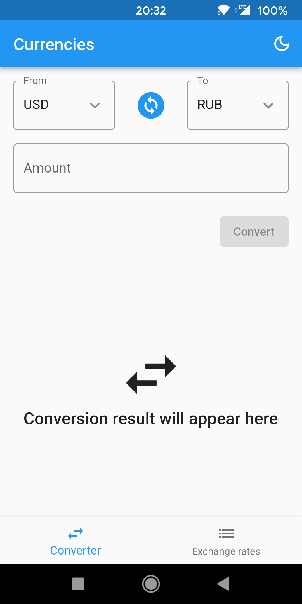
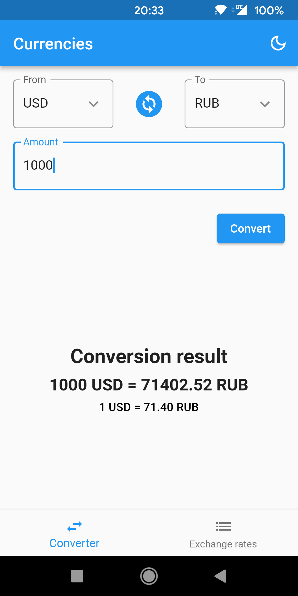
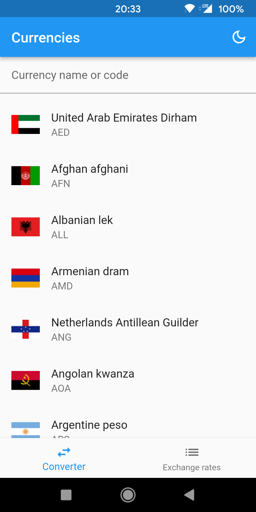
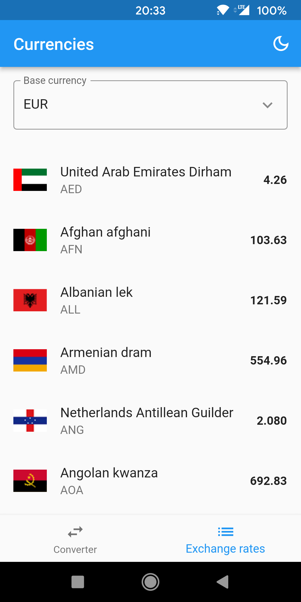
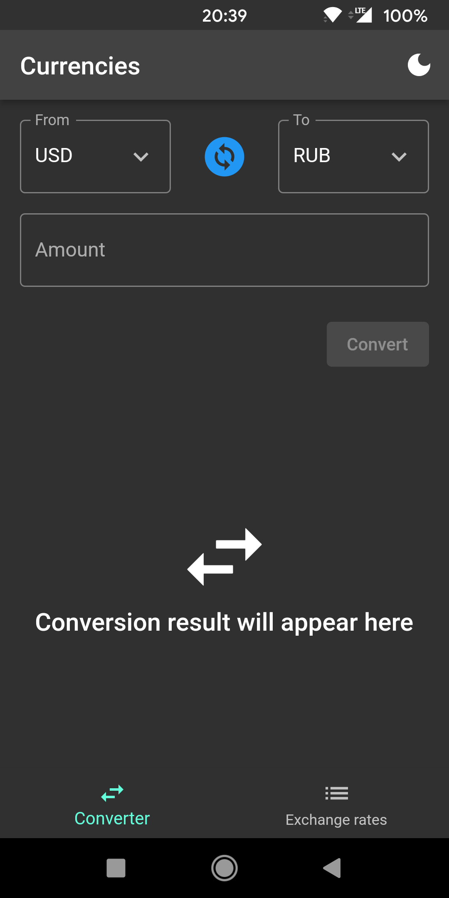
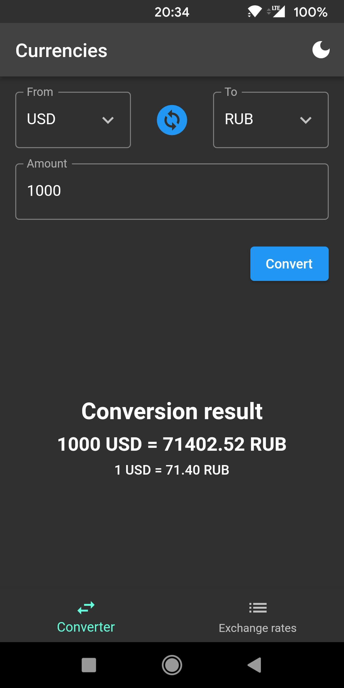
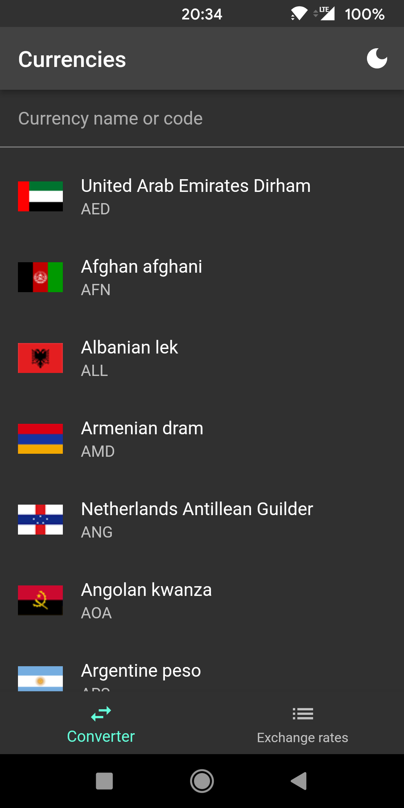
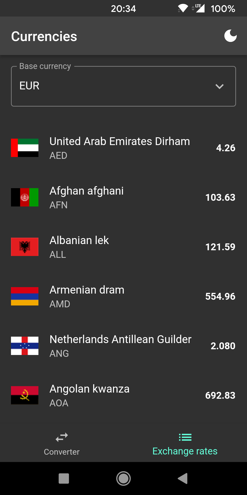

# Currencies

Currencies converter and exchange rates list written in Flutter.

Currency exchange rates source: https://github.com/fawazahmed0/currency-api

# Screenshots:

## Light:

## Dark:

